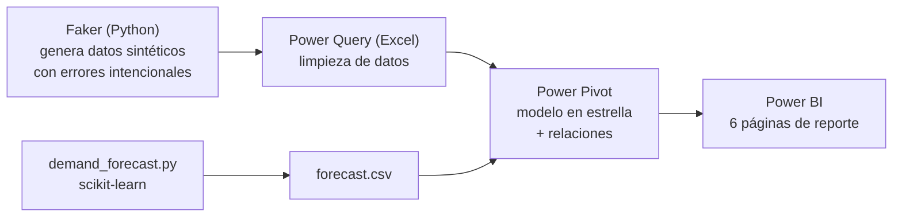
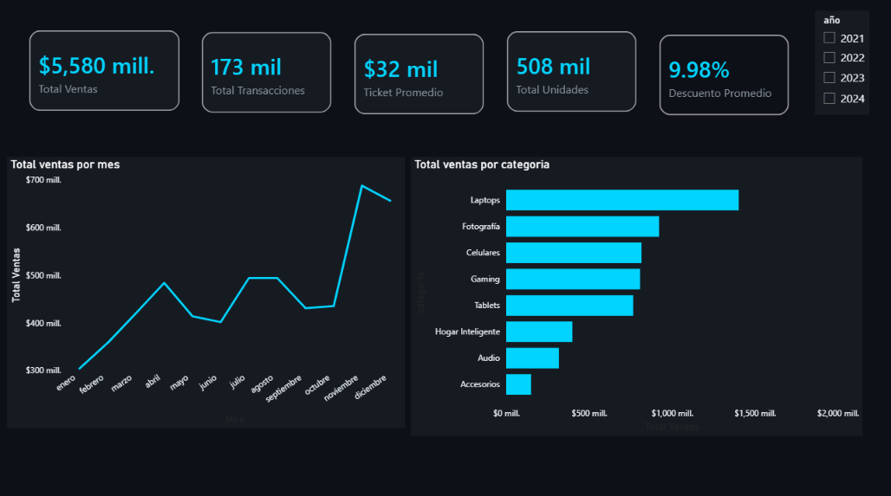
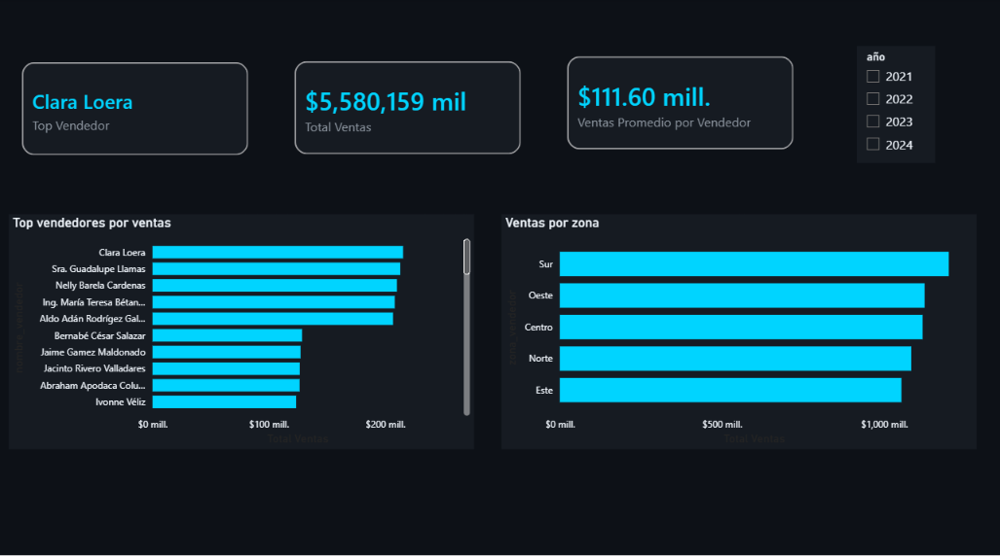
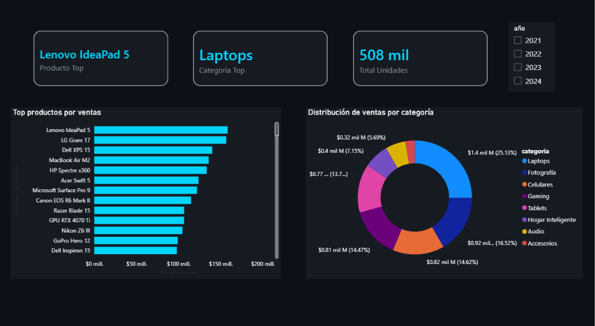
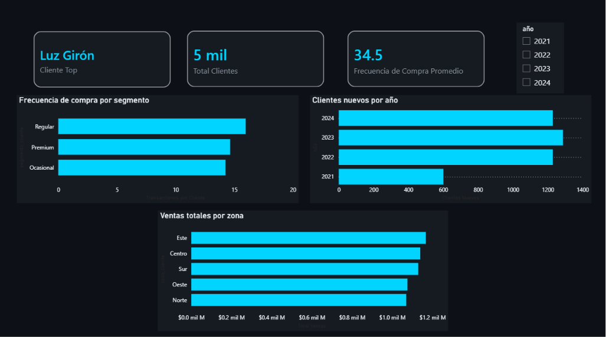
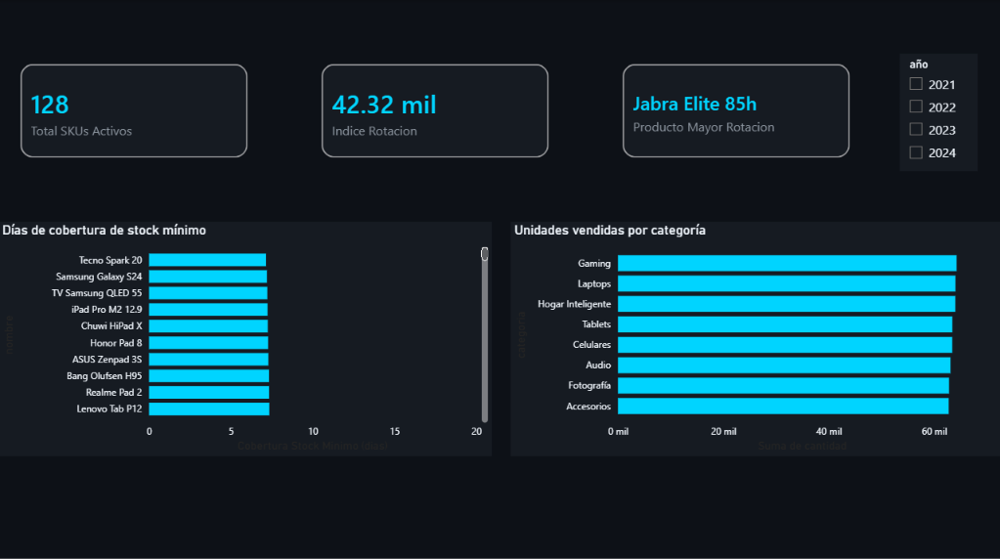
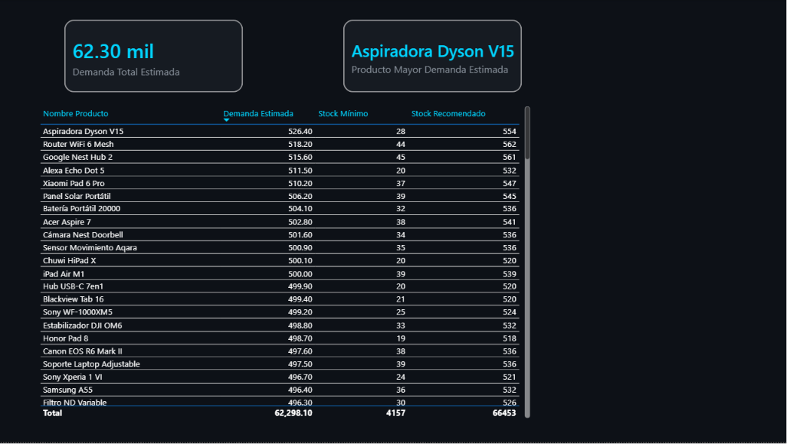

# Retail Electrónica — Dashboard de Ventas, Inventario y Demanda Predictiva

Reporte de inteligencia de negocio de punta a punta para una cadena regional de electrónica (5 zonas, ~50 vendedores, 128 productos): desde la generación y limpieza de datos hasta la visualización ejecutiva y una capa de analítica predictiva.

**La idea detrás de este proyecto:** con herramientas que usa cualquier empresa (Excel, Power BI, Python) y pensamiento de negocio, no hace falta ser experto de una industria para convertir datos en decisiones. El pipeline completo está automatizado — actualizar el reporte con datos nuevos es soltar un archivo en una carpeta y correr un script, no reescribir nada.

---

## Contexto de negocio

Simula una cadena regional de electrónica de tamaño medio-grande: laptops, celulares, audio, gaming, fotografía, tablets, hogar inteligente y accesorios, vendidos a través de 50 vendedores distribuidos en 5 zonas (Norte, Sur, Centro, Este, Oeste), a una base de ~5,000 clientes, entre 2021 y 2024.

Los datos son sintéticos (generados con Faker), pero con volumen y magnitudes calibradas para ser creíbles: ~1,300 millones MXN de venta anual total, ~26-31 millones MXN por vendedor al año — comparable a una cadena especializada de electrónica de alto ticket.

## Objetivo

Responder, con un solo reporte, tres preguntas que cualquier gerencia de retail necesita:

1. **¿Cómo va el negocio?** (Resumen Ejecutivo, Vendedores, Productos, Clientes)
2. **¿Qué hay que reponer?** (Inventario — rotación y cobertura de stock)
3. **¿Qué se va a vender el próximo mes?** (Predicción — forecasting con Machine Learning)

## Arquitectura del pipeline



El pipeline es reproducible: cada vez que se agregan datos nuevos (por ejemplo, una exportación mensual de un CRM), basta con soltar el archivo en `datos_brutos/`, correr `demand_forecast.py` para reentrenar el modelo con el comportamiento más reciente, y refrescar Excel → Power BI. No requiere tocar código para actualizarse.

## Estructura del repositorio

```
retail_electronica/
├── datos_brutos/          # 48 archivos mensuales de ventas + catálogos (CSV)
├── scripts/
│   ├── generar_datos.py       # genera datos sintéticos con Faker (errores intencionales incluidos)
│   └── demand_forecast.py     # entrena el modelo y exporta el forecast del próximo mes
├── outputs/
│   └── forecast.csv           # salida del modelo, se recalcula en cada corrida
├── retail_electronica.xlsx    # limpieza (Power Query) + modelo (Power Pivot)
└── retail_electronica.pbix    # reporte final (Power BI)
```

## Modelo de datos

Esquema en estrella: una tabla de hechos y tres dimensiones.

- **`datos_brutos`** (hechos): una fila por transacción — producto, cliente, vendedor, fecha, cantidad, precio, descuento, monto total. ~170,000 filas (2021-2024).
- **`catalogo_productos`** (dimensión): id, nombre, categoría, precio base, stock mínimo.
- **`catalogo_clientes`** (dimensión): id, nombre, ciudad, zona, segmento, fecha de registro.
- **`catalogo_vendedores`** (dimensión): id, nombre, zona, fecha de ingreso.
- **`forecast`**: salida del modelo de ML, relacionada 1 a 1 con `catalogo_productos`.

Los datos crudos incluyen errores intencionales (categorías mal escritas, fechas en formato inconsistente, nulos, montos negativos) para poder practicar y demostrar limpieza real con Power Query, en vez de partir de un dataset ya limpio.

## Páginas del dashboard

| Página | Contenido |
|---|---|
| **Resumen Ejecutivo** | KPIs globales (ventas, transacciones, ticket promedio) y tendencia mensual — vista de 30 segundos para dirección. |
| **Vendedores** | Ranking de vendedores y ventas por zona. |
| **Productos** | Ranking de productos y distribución de ventas por categoría. |
| **Clientes** | Segmentación, clientes nuevos por año, ventas por zona. |
| **Inventario** | Rotación de productos y cobertura de stock mínimo (ver decisión de diseño abajo). |
| **Predicción** | Demanda estimada para el próximo mes por producto, generada con el modelo de ML. |

La página de Resumen Ejecutivo agrega las métricas de más alto nivel; las demás páginas hacen drill-down por dimensión (vendedor, producto, cliente, inventario) — así se evita que el usuario tenga que interpretar todo en una sola pantalla saturada.

### Capturas

**Resumen Ejecutivo**


**Vendedores**


**Productos**


**Clientes**


**Inventario**


**Predicción**


## Decisiones de diseño y criterio analítico

Algunas decisiones que vale la pena explicar, porque no son obvias a simple vista:

- **Cobertura de stock en días, no alerta de stock real.** El dataset no incluye una columna de stock actual (solo stock mínimo por producto). En vez de simular un número falso de "stock disponible", se optó por una métrica honesta: cuántos días duraría el stock mínimo al ritmo de venta actual de cada producto (`stock_mínimo ÷ ventas promedio diaria`). Es una limitación reconocida, convertida en una métrica útil y defendible.
- **Estandarización de categorías.** Los datos sucios incluían variantes como `fotografia` (sin tilde) que Power Query no puede normalizar solo con mayúsculas/recorte — se resolvió con un reemplazo explícito tras identificar el patrón exacto que introduce el generador.
- **Escala de negocio verificada, no asumida.** Antes de dar por buenos los números, se validó que el volumen de ventas por vendedor (~26-31M MXN/año) fuera consistente con un negocio de electrónica de alto ticket, y no un artefacto de la generación de datos.
- **Combinación de año + mes para series de tiempo.** Agregar por "mes" (1-12) sin año mezclaría enero de 2021 con enero de 2024. Todas las medidas de series de tiempo (rotación, cobertura, forecast) usan una llave de periodo real.
- **Nombres de producto sin duplicar (128, no 200).** Al comparar la tarjeta "Producto Top" contra la gráfica "Top productos por ventas" aparecía un desfase: la tarjeta mostraba un producto distinto al que la gráfica marcaba como #1. Rastreando el origen, dos productos distintos (con `id_producto` diferente) podían tener el mismo nombre — el catálogo generaba 25 productos por categoría repartidos entre solo 16 nombres reales por categoría, así que 9 de cada 25 quedaban con un nombre duplicado. Cualquier visual que agrupara por nombre (en vez de por id) sumaba sin querer las ventas de dos productos distintos bajo una sola etiqueta, inflando el resultado. Se corrigió bajando el catálogo a 128 productos (16 nombres únicos × 8 categorías), eliminando el problema de raíz en vez de parchar cada medida afectada.
- **Zona y stock mínimo con relación real, no aleatoria.** En la primera versión del generador, la zona del vendedor y la zona del cliente se asignaban de forma independiente en cada venta, y `stock_minimo` era un número aleatorio sin relación con la demanda del producto — dos decisiones que, al cruzarlas en el dashboard, producían lecturas sin sentido de negocio (zonas invertidas entre vistas, coberturas de stock imposibles). Se corrigió el generador para que el 82% de las ventas empareje vendedor y cliente de la misma zona (18% son ventas cruzadas, algo real en cualquier equipo comercial) y para que `stock_minimo` se derive de la demanda promedio real de cada producto (7-15 días de cobertura). El resto del pipeline —Power Query, Power Pivot, medidas DAX, el modelo de ML— no necesitó ningún cambio: el ajuste vivió enteramente en cómo se generan los datos de origen.

## Hallazgos de negocio

- **Concentración de riesgo en una sola categoría.** Laptops representa ~26% de las ventas totales y también el producto individual más vendido — es la categoría de mayor precio por unidad, así que sostiene el negocio, pero también es el punto único de falla más grande: un problema de proveedor o una caída de demanda ahí pega directo al total.
- **Consistencia entre zona del vendedor y zona del cliente.** Con el generador corregido, "ventas por zona del vendedor" y "ventas totales por zona del cliente" muestran magnitudes consistentes entre sí (ambas en un rango estrecho, sin zonas que tripliquen a otras), reflejando que la mayoría de las ventas ocurre dentro de la misma zona y que el resto es venta cruzada real — no ruido de datos.
- **La cobertura de stock mínimo ahora aísla riesgo real.** Al calibrar `stock_minimo` contra la demanda real de cada producto, la lista de productos con menor cobertura (y el producto de mayor rotación) cambió por completo frente a la versión con datos sin calibrar — son los candidatos genuinos a quedarse sin stock, no un efecto del azar.

## Componente de Machine Learning

`demand_forecast.py` entrena un modelo de **Random Forest** (scikit-learn) para predecir la demanda del próximo mes por producto, usando como variables el historial de ventas de cada producto (ventas de los últimos 1, 2 y 3 meses, y su promedio móvil).

- Evaluado contra un conjunto de prueba (80/20), con un MAE (error absoluto promedio) de referencia impreso en cada corrida.
- La salida (`forecast.csv`) incluye la demanda estimada y una recomendación de stock (demanda estimada + colchón de seguridad del stock mínimo).
- Se reentrena por completo cada vez que se ejecuta, tomando todo el historial disponible — así se ajusta solo a nuevos patrones de comportamiento sin necesidad de tocar el código.

Es un modelo intencionalmente simple (no ARIMA/Prophet, no tuning de hiperparámetros): suficiente para demostrar una capa predictiva funcional y explicable, sin salirse del alcance de un proyecto de analista de datos.

## Cómo reproducirlo

```bash
# 1. Generar los datos sintéticos
cd scripts
python generar_datos.py

# 2. Abrir retail_electronica.xlsx y actualizar todo (Datos → Actualizar todo)

# 3. Generar el forecast
pip install pandas scikit-learn --break-system-packages
python demand_forecast.py

# 4. Cargar forecast.csv al modelo de datos de Excel y actualizar Power BI
```

## Tecnologías

Python (pandas, numpy, Faker, scikit-learn) · Excel (Power Query, Power Pivot, DAX) · Power BI

## Limitaciones y próximos pasos

- No hay columna de stock en tiempo real — la cobertura de stock es una aproximación, documentada como tal.
- El modelo de forecasting no se compara todavía contra una línea base ingenua (ej. "igual que el mes anterior"); sería el siguiente paso para cuantificar cuánto valor agrega el modelo.
- El reporte vive como archivo `.pbix` y se comparte directamente — no está publicado en Power BI Service, así que para abrirlo hace falta Power BI Desktop instalado.

---

*Proyecto de portafolio — Cristian Guevara. Parte de una serie de proyectos de análisis de datos que cubren distintos dominios (retail, movilidad urbana, análisis de datos del sector blockchain) para demostrar adaptabilidad a distintos contextos de negocio con las mismas herramientas y criterio analítico.*